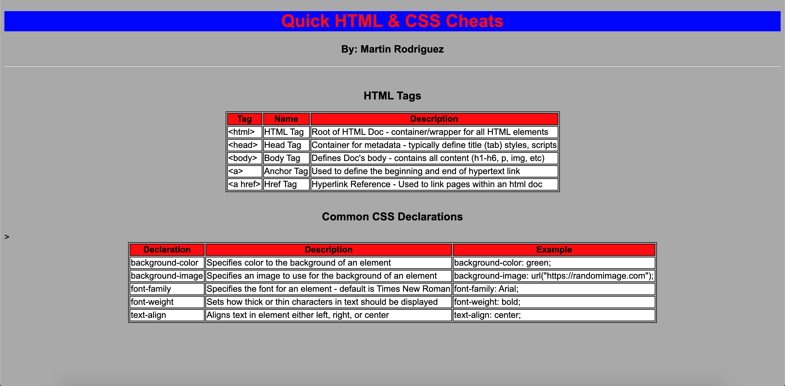

# Quick HTML & CSS Cheats

"Quick HTML & CSS Cheats" is quick reference to some very basic tags that make up an HTML Document and some common CSS Declaritives used when formatting and styling.

## Technologies

<ul>
    <li>HTML</li>
    <li>CSS</li>
    <li>Git</lit>
</ul>

## Installation

<ol>
    <li>Install <strong>VS Code</strong></li>
    <li>Download from this repository and store in local file of choosing</li>
    <li>Open in VS Code</li>
</ol>

## Visuals

Preview: 

## Purpose & Future Edits

The purpose behind this little project is to get back into Software Engineering full force, post-pandemic - what better way to start than with the building blocks of Web Development, HTML & CSS!

This project was inspired by the Developers & Instructors over at <a href="https://www.codecademy.com/" target="_blank" alt="Link to Code Academy website">Codeacademy</a>.

It can also be a great refresher and form of studying/learning for fresh new developers getting familiar with so many news terms and syntax!

Use my code as a reference and feel free to add on to it!

<strong>Open to contributions!</strong>

## Authors & Acknowledgement

<strong>CodeAcademy</strong> - thank you for providing world class guided learning and including external resources to cover any and every knowledge gap.

<strong>Myself!</strong> - thank you for taking the initiative to get back on board with Software Engineering and reigniting the flame!
